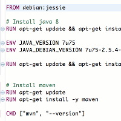

#### Edit, build, run Docker containers from Eclipse 

##### Dockerfile Syntax Highlighting

##### Dockerfile Auto Complete

##### Execute Docker commands

## Installation

#### Direct plugin link: 

#### Detailed install procedure:

##### 1. Start Eclipse
Select Help > Install New Software... In the dialog that appears, enter the update site URL into the "Work with" text box: https://dl.bintray.com/zenika/doclipser
And press the enter key.

##### 2. Select the checkbock next to the component you want to install and click Next.

##### 3. Review the features that you are about to install. Click Next.

##### 4. Read the license agreements and then select I accept the terms of the license agreements. Click Finish.

##### 5. Click OK on the Security Warning.

##### 6. You will then be asked if you would like to restart Eclipse. Click Restart Now.

## Configuration

## Contributing

1. Fork it!
2. Create your feature branch: `git checkout -b my-new-feature`
3. Commit your changes: `git commit -am 'Add some feature'`
4. Push to the branch: `git push origin my-new-feature`
5. Submit a pull request :D

## History
2015-04-07 First draft available for internal review

## Credits
* [Spotify Java Docker API](https://github.com/spotify/docker-client)
* [Xtext](https://eclipse.org/Xtext/) framework for the Dockerfile grammar definition
* [BinTray distribution service](http://bintray.com)
* [Docker](http://docker.com)

## License
[Eclipse Public License v1.0](https://www.eclipse.org/legal/epl-v10.html)
